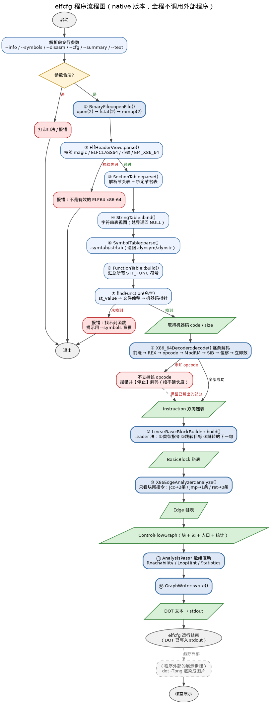

# 程序流程图（native 版本）

> 图片由 `docs_native/flowchart.dot` 渲染：`dot -Tpng flowchart.dot -o flowchart_native.png`

---

## 一、Mermaid 版本（可复制到 Typora）

```mermaid
flowchart TD
    A([启动]) --> B["解析命令行参数<br/>--info / --sections / --symbols / --disasm / --cfg / --summary / --text"]
    B --> C{"参数合法?"}
    C -->|"否"| C1["打印用法 / 报错"] --> Z1([退出])
    C -->|"是"| D["open&#40;2&#41; 打开 ELF 文件"]
    D --> E["fstat&#40;2&#41; 取文件大小"]
    E --> F["mmap&#40;2&#41; 映射到内存"]
    F --> G["校验 ELF 头<br/>magic / ELFCLASS64 / 小端 / EM_X86_64"]
    G -->|"不通过"| G1["报错: 不是有效的 ELF64 x86-64"] --> Z2([退出])
    G -->|"通过"| H["解析节头表 SectionTable"]
    H --> I["绑定节名字符串表 StringTable"]
    I --> J["解析符号表<br/>.symtab / .dynsym"]
    J --> K["构建函数表 FunctionTable"]
    K --> L["按名字查找函数"]
    L --> M{"找到函数?"}
    M -->|"否"| M1["报错: 找不到函数<br/>提示用 --symbols 查看"] --> Z3([退出])
    M -->|"是"| N["取得机器码 code / size"]

    N --> O["X86_64Decoder 逐条解码<br/>前缀→REX→opcode→ModRM→SIB→disp→imm"]
    O -->|"未知 opcode"| O1["报错并停止解码<br/>不猜测长度"] --> P
    O --> P["Instruction 双向链表"]

    P --> Q["Leader 法收集入口<br/>①首条指令 ②跳转目标 ③跳转的下一句"]
    Q --> R["BasicBlock 链表"]
    R --> S["按块尾指令连边<br/>Jcc→2条 / jmp→1条 / ret→0条"]
    S --> T["Edge 链表"]
    T --> U["ControlFlowGraph"]

    U --> V["AnalysisPass 指针数组驱动<br/>Reachability / LoopHint / Statistics"]
    V --> W["GraphWriter"]
    W --> X["DOT 文本（stdout）"]
    W --> Y["文本 CFG（--text）"]
    X --> Z([elfcfg 运行结束])

    Z -.->|"程序外部（展示步骤）"| AA["dot -Tpng 渲染成图片"]
    AA --> AB([课堂展示])

    classDef pass fill:#dde7f5,stroke:#3b6ea5,stroke-width:2px
    classDef data fill:#d8f0d8,stroke:#2e7d32
    classDef outside fill:#f7f7f7,stroke:#999999,stroke-dasharray:5 5,color:#555555
    classDef term fill:#f0f0f0,stroke:#555555
    class O,Q,S,V pass
    class P,R,T,U,X,Y data
    class AA outside
    class A,Z1,Z2,Z3,Z,AB term
```

---

## 二、流程图要点说明

### 2.1 系统调用发生在最前面

`open` → `fstat` → `mmap` 三步都在 `MappedBinaryFile::openFile()` 里完成，
之后整个程序只在**只读映射区**上工作，不再碰文件。

### 2.2 错误分支贯穿全程

与早期版本"出错就崩"不同，native 版在每一层都有明确的失败出口：

| 阶段 | 失败情况 | 行为 |
|------|---------|------|
| 文件访问 | 文件不存在 / 不是普通文件 / 空文件 / mmap 失败 | 报错 + 退出码 2 |
| ELF 校验 | magic 错 / 非 64 位 / 大端 / 非 x86-64 / 表越界 | 报错 + 退出码 2 |
| 函数定位 | 找不到符号 / 符号无机器码 | 报错 + 退出码 3 |
| 指令解码 | 未知 opcode / 数据不足 | **停止解码并报错**，已解出的部分继续用于 CFG |
| 基本块/连边 | 跳转目标不在函数内 | 警告，跳过该边 |

### 2.3 关键约束：不猜测长度

流程图里 `O -->|未知 opcode| O1` 这一条是**设计上的硬约束**：
遇到不认识的指令必须停下，绝不能假定它长 1 字节继续解码 ——
那会让后续所有指令错位，产出完全错误的 CFG。

### 2.4 渲染在程序之外

`dot -Tpng` 画成虚线框，表示它**不属于 elfcfg**。
elfcfg 把 DOT 写到 stdout 后即运行结束；渲染是课堂展示环节的动作。
