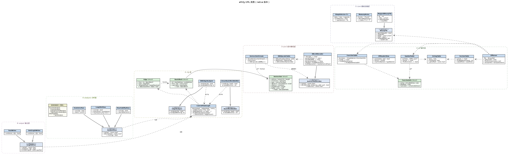

# UML 类图（native 版本）



> 图片由 `docs_native/uml.dot` 渲染：`dot -Tpng uml.dot -o uml_native.png`

---

## 一、Mermaid 版本（可复制到 Typora）

```mermaid
classDiagram
    direction TB

    %% ================= ① 基础设施层 =================
    class BinaryFile {
        <<abstract>>
        +openFile(path) bool
        +closeFile() void
        +data() const unsigned char*
        +size() size_t
        +isOpen() bool
        +rangeValid(offset, length) bool
        +at(offset, length) const unsigned char*
    }
    class MappedBinaryFile {
        -int fd_
        -unsigned char* map_
        -size_t size_
        +openFile(path) bool
        +closeFile() void
        +data() const unsigned char*
        +size() size_t
    }
    BinaryFile <|-- MappedBinaryFile : 继承（mmap 实现）

    class MemoryArena {
        -Chunk* chunks_
        +allocateRaw(bytes) void*
        +create~T~() T*
        +totalBytes() size_t
        +liveObjects() size_t
    }
    class SimpleVector~T~ {
        -T* data_
        -size_t size_
        -size_t capacity_
        +pushBack(v) bool
        +operator[](i) T&
        +size() size_t
    }

    %% ================= ② ELF 解析层 =================
    class ElfParser {
        -BinaryFile* file_
        -ElfHeaderView header_
        -SectionTable sections_
        -SymbolTable symtab_
        -SymbolTable dynsym_
        -FunctionTable functions_
        +open(path) bool
        +findFunction(name, out) bool
        +dumpInfo() void
        +dumpSections() void
        +dumpSymbols() void
    }
    class ElfHeaderView {
        +parse(data, size) bool
        +machineName() const char*
        +typeName() const char*
        +entry() uint64_t
    }
    class SectionTable {
        -const Elf64_Shdr* headers_
        -StringTable names_
        +parse(...) bool
        +findByName(name) int
        +dataOf(index) const unsigned char*
        +findByAddress(addr) int
    }
    class StringTable {
        -const unsigned char* base_
        -size_t size_
        +bind(base, size) void
        +get(offset) const char*
    }
    class SymbolTable {
        -const Elf64_Sym* symbols_
        -size_t count_
        -StringTable strings_
        +parse(...) bool
        +findFunction(name, ...) bool
        +fillFunctionInfo(...) bool
    }
    class FunctionInfo {
        +char name[128]
        +uint64_t virtualAddress
        +uint64_t size
        +uint64_t fileOffset
        +const unsigned char* code
        +hasCode() bool
    }
    class FunctionTable {
        -SimpleVector~FunctionInfo~ functions_
        +build(symtab, sections, ...) bool
        +findByName(name) const FunctionInfo*
        +findByAddress(addr) const FunctionInfo*
    }

    ElfParser *-- BinaryFile : 持有
    ElfParser *-- ElfHeaderView
    ElfParser *-- SectionTable
    ElfParser *-- SymbolTable
    ElfParser *-- FunctionTable
    SectionTable *-- StringTable : 节名表
    SymbolTable *-- StringTable : 符号名表
    SymbolTable ..> FunctionInfo : 生产
    FunctionTable o-- FunctionInfo : 聚合

    %% ================= ③ 指令解码层 =================
    class InstructionDecoder {
        <<abstract>>
        +name() const char*
        +decode(code, remaining, address, out) bool
        +lastError() const char*
        +decodedCount() unsigned long
    }
    class X86_64Decoder {
        -unsigned long decodedCount_
        -char lastError_[256]
        +decode(code, remaining, address, out) bool
        -parsePrefixes(...) size_t
        -parseModRM(...) long
        -parseImmediate(...) long
        -classify(ins, entry) void
        -buildMnemonic(ins, entry) void
        -buildOperands(ins, entry) void
        -resolveControlFlow(ins, entry) void
    }
    InstructionDecoder <|-- X86_64Decoder : 继承

    class Instruction {
        +uint64_t address
        +unsigned char bytes[16]
        +unsigned int length
        +char mnemonic[32]
        +char operands[192]
        +InstructionType type
        +bool isBranch
        +bool isConditional
        +bool isCall
        +bool isReturn
        +bool isIndirect
        +bool targetKnown
        +uint64_t target
        +bool leader
        +Instruction* prev
        +Instruction* next
        +DecodedFields fields
    }
    class InstructionStream {
        <<utility>>
        +decodeInstructionStream(decoder, code, size, base, arena, ...) Instruction*
    }
    class X86OpcodeTable {
        <<utility>>
        +x86LookupOpcode(opcode, isTwoByte) const X86OpcodeEntry*
        +x86Group1Name(reg) const char*
        +x86ConditionName(code) const char*
    }

    InstructionStream ..> InstructionDecoder : 使用（基类指针）
    InstructionStream ..> Instruction : 生产
    X86_64Decoder ..> X86OpcodeTable : 查表
    X86_64Decoder ..> Instruction : 填充

    %% ================= ④ CFG 层 =================
    class BasicBlock {
        +int id
        +uint64_t startAddress
        +uint64_t endAddress
        +Instruction* first
        +Instruction* last
        +bool reachable
        +bool loopHeader
        +BasicBlock* next
        +instructionCount() int
        +contains(address) bool
    }
    class Edge {
        +BasicBlock* from
        +BasicBlock* to
        +EdgeType type
        +uint64_t targetAddress
        +bool targetResolved
        +bool isBackwardHint
        +const char* label
        +Edge* next
    }
    class ControlFlowGraph {
        -MemoryArena* arena_
        -BasicBlock* blocksHead_
        -Edge* edgesHead_
        -BasicBlock* entry_
        +addBlock(start, first, last) BasicBlock*
        +addEdge(from, to, type, target, resolved, label) Edge*
        +findBlockByAddress(addr) BasicBlock*
        +blockContaining(addr) BasicBlock*
        +blockCount() size_t
        +edgeCount() size_t
        +printSummary() void
    }
    class BasicBlockBuilder {
        <<abstract>>
        +name() const char*
        +build(cfg, head) bool
        #endsBlock(ins) int
        #addLeader(...) void
    }
    class LinearBasicBlockBuilder {
        +build(cfg, head) bool
        #endsBlock(ins) int
    }
    BasicBlockBuilder <|-- LinearBasicBlockBuilder : 继承（重写 endsBlock）

    class EdgeAnalyzer {
        <<abstract>>
        +name() const char*
        +analyze(cfg) bool
        #analyzeBlock(cfg, b) void
    }
    class X86EdgeAnalyzer {
        +analyze(cfg) bool
        #analyzeBlock(cfg, b) void
    }
    EdgeAnalyzer <|-- X86EdgeAnalyzer : 继承（重写 analyzeBlock）

    ControlFlowGraph *-- BasicBlock : 持有
    ControlFlowGraph *-- Edge : 持有
    BasicBlock o-- Instruction : 聚合 first/last
    Edge --> BasicBlock : from / to
    LinearBasicBlockBuilder ..> ControlFlowGraph : 生产块
    X86EdgeAnalyzer ..> ControlFlowGraph : 生产边

    %% ================= ⑤ 分析层 =================
    class AnalysisPass {
        <<abstract>>
        +name() const char*
        +description() const char*
        +run(cfg) bool
    }
    class ReachabilityPass {
        +run(cfg) bool
        +reachableCount() size_t
    }
    class LoopHintPass {
        +run(cfg) bool
        +hintCount() size_t
        +printHints(cfg) void
    }
    class StatisticsPass {
        +run(cfg) bool
        +print() void
    }
    class FunctionAnalysis {
        <<abstract>>
    }
    class DataFlowPass {
        <<abstract>>
        +solve(cfg) int
    }
    AnalysisPass <|-- ReachabilityPass
    AnalysisPass <|-- LoopHintPass
    AnalysisPass <|-- StatisticsPass
    AnalysisPass <|-- FunctionAnalysis : 后续实验接口
    AnalysisPass <|-- DataFlowPass : 后续实验接口
    FunctionAnalysis <|-- StackAnalysis
    FunctionAnalysis <|-- DangerousCallAnalysis
    FunctionAnalysis <|-- MemoryAccessAnalysis
    DataFlowPass <|-- TaintAnalysis
    AnalysisPass ..> ControlFlowGraph : 分析

    %% ================= ⑥ 输出层 =================
    class GraphWriter {
        <<abstract>>
        +name() const char*
        +write(out, cfg) bool
        #writeEscaped(out, s) void
        #dotEscapeText(dst, size, src) int
    }
    class DotGraphWriter {
        +write(out, cfg) bool
    }
    class TextWriter {
        -bool showInstructions_
        +write(out, cfg) bool
    }
    GraphWriter <|-- DotGraphWriter : 继承
    GraphWriter <|-- TextWriter : 继承
    GraphWriter ..> ControlFlowGraph : 读取
```



---

## 二、六组继承关系速查

| 抽象基类 | 派生类 | 纯虚/虚函数 | 多态的意义 |
|---------|--------|------------|-----------|
| `BinaryFile` | `MappedBinaryFile` | `openFile/closeFile/data/size` | 换用 `read()` 实现时上层不变 |
| `InstructionDecoder` | `X86_64Decoder` | `decode()` | 换架构（ARM/MIPS）只需换派生类 |
| `BasicBlockBuilder` | `LinearBasicBlockBuilder` | `build()` + 虚 `endsBlock()` | 不同划分策略（如按异常表）可替换 |
| `EdgeAnalyzer` | `X86EdgeAnalyzer` | `analyze()` + 虚 `analyzeBlock()` | 不同指令集出边规则可替换 |
| `AnalysisPass` | `Reachability` / `LoopHint` / `Statistics` | `run()` | 新增分析不必改主流程 |
| `GraphWriter` | `DotGraphWriter` / `TextWriter` | `write()` | 可扩展 JSON / 数据库输出 |

---

## 三、类之间的数据流

```
BinaryFile ──► ElfParser ──► FunctionInfo ──► InstructionStream ──► Instruction
                                                                        │
                                                                        ▼
                                    ControlFlowGraph ◄── EdgeAnalyzer ───┤
                                          ▲                             │
                                          │                             ▼
                              BasicBlockBuilder ──────────────────► BasicBlock
                                          ▲
                                          │
                                    AnalysisPass
                                          ▲
                                          │
                                    GraphWriter ──► DOT / Text
```
